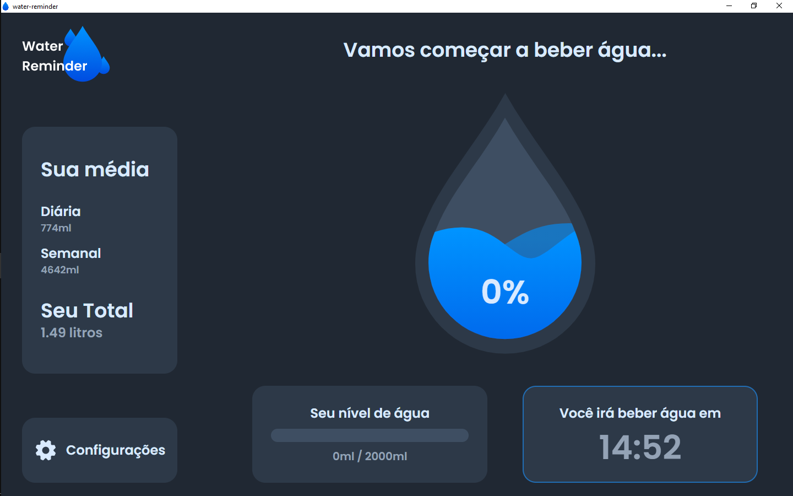
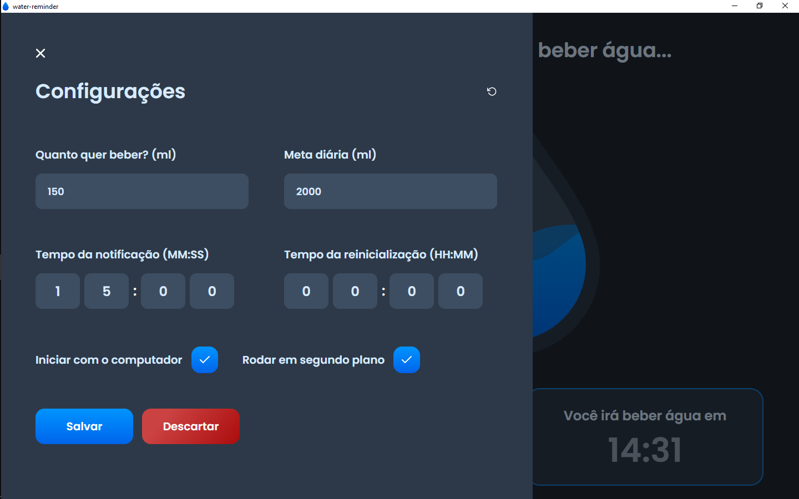

# Water Reminder

Water Reminder is a desktop app using electron to remember the user to drink water periodically.

At the moment the only supported language is pt-br.

## Features

- Hide to tray when closed
- Open on startup
- Notify when you need to drink water
- Calculate how much water you drink every day and week
- Counts the total water drank by you on the app

## Screenshots

### Full app

### Home Page

### Config Page

---

# TODO

## Usage

## Installation for development

## Used Tools and conventions
